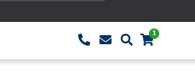

# TYPO3 Extension `cart_count`

This extensions provides a basic endpoint to fetch information from current cart session when using the TYPO3 extension [cart](https://github.com/extcode/cart).
The main benefit is to have pages still cacheable and show e.g. the count of articles in the cart.studiomitte



```json
{
    "net":551,
    "gross":551,
    "count":1,
    "products": [
        {
            "title":"A title",
            "sku":"1234",
            "net":551,
            "gross":551,
            "quantity":1
        }
    ]
}
```

## Installation

Install this extension by using `composer require studiomitte/cart-count`.

## Usage

By calling the URL `/?cartId=123` you can retrieve the cart information. `123` is the page configured in the cart plugins where the order is saved.

This extension **does not** any JS to fetch the data but one example can be

```js
$.get("/?cartId=195", function (data) {
    if (data.count > 0) {
        $(".cart__icon__wrapper").append("<span class='cart__count cart__count--big'>" + data.count + "</span>");
    }
});
```


## Credits

This extension was created by Georg Ringer for [Studio Mitte, Linz](https://studiomitte.com) with ♥.

[Find more TYPO3 extensions we have developed](https://www.studiomitte.com/loesungen/typo3) that provide additional features for TYPO3 sites. 

